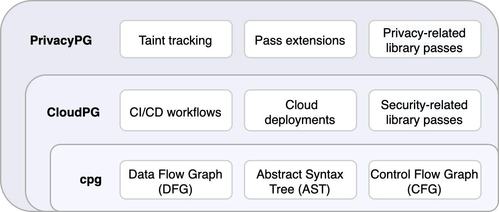

# Cloud Property Graph (CloudPG) / Privacy Property Graph

The Cloud Property Graph [1] is based on a Code Property Graph and tries to connect static code analysis and Cloud runtime assessment. It is based on the [CPG](https://github.com/Fraunhofer-AISEC/cpg) project by Fraunhofer AISEC. We plan to contribute certain parts of this project back to the upstream repo, once they are more matured.

We have recently extended the CloudPG to also enable software privacy analyses. This extension is called the Privacy Property Graph [2]. This extension includes, among others, a taint tracking mechanism for personal data.
The following graphic describes the differences between cpg, CloudPG, and Privacy Property Graph (PPG).

Furthermore, we plan to integrate a Go-based version of the CloudPG into our main Cloud assessment tool, [Clouditor](https://github.com/clouditor/clouditor).
Note that this project primarily serves as a research prototype, so please do not expect API stability.

## Setup and Build

### Python Setup
Please follow the instruction at https://github.com/ninia/jep/wiki/Getting-Started#installing-jep to install jep. Also, make sure you are using Python 3.10.

### Build
Note that we recommend using Java 17. First, the graph classes need to be built from the Ontology definitions by calling `./build-ontology.sh`. We aim to automate this process using a Gradle plugin in the future. Then, build using `./gradlew installDist`.

## Usage
 
Start neo4j using `docker run -d --env NEO4J_AUTH=neo4j/password -p7474:7474 -p7687:7687 neo4j`. 

Run `cloudpg/build/install/cloudpg/bin/cloudpg`. This will print a help message with any additional needed parameters. The root path is required and the program can be called as follows: `cloudpg/build/install/cloudpg/bin/cloudpg --root=/x/testprogramm folder1/ folder2/ folder 3/`
To also enable the taint tracking of privacy labels, include the `--enable-labels` flag: `cloudpg/build/install/cloudpg/bin/cloudpg --enable-labels --root=/x/testprogramm folder1/ folder2/ folder 3/`

The CloudPG / PPG can be used on various programming languages, such as Java, Go, Python, Typescript, and more (some of these are still in an experimental status). Also, it analyzes GitHub workflow files (see https://docs.github.com/en/actions/using-workflows).

## Developing Passes

Passes are extensions of the Cloud Property Graph that can create and modify nodes and edges.
Passes can be language- or framework-specific, for example to create a LogOutput node when a specific logging library is used.
The goal of passes is to abstract away language specifics and other details, allowing to write simple, generic, reusable queries

Some implementation details need to be considered when writing passes:
- New passes need to be registered in `App.kt` (`registerPass()` in the `doTranslate()` method)
- Passes must overwrite the `accept` and `cleanup` methods
- Newly created nodes need to be added to the `translationResult` (`t += n`)
- Add a DFG edge via `node1.addNextDFG(node2)`

## Testing
The CloudPG includes a testing library that provides test cases for certain threats. At the moment, these threats primarily include privacy threats. For more information, see [ppg-testing-library](https://github.com/clouditor/cloud-property-graph/tree/main/ppg-testing-library) folder. 

## Further reading

[1] Christian Banse, Immanuel Kunz, Angelika Schneider and Konrad Weiss. Cloud Property Graph: Connecting Cloud Security Assessments with Static Code Analysis. IEEE CLOUD 2021. https://doi.org/10.1109/CLOUD53861.2021.00014
[2] Immanuel Kunz, Konrad Weiss, Angelika Schneider and Christian Banse. Privacy Property Graph: Towards Automated Privacy Threat Modeling via Static Graph-based Analysis. Proceedings on Privacy Enhancing Technologies 2022.
